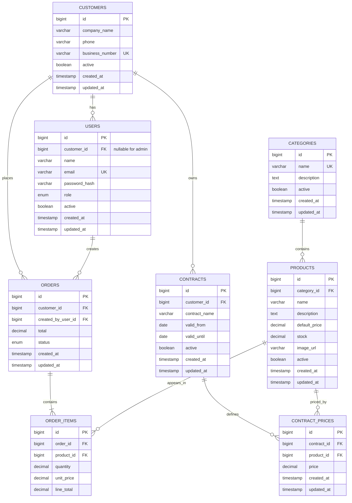

# FreshFlow B2B Ordering Platform — ERD

## Document purpose

This document explains the relational data model used by the FreshFlow B2B
ordering platform. It complements `db/schema.sql` by describing the business
meaning of the entities, their relationships, constraints, and rules that must
be enforced by the application rather than by the database alone.

Use it when reviewing the architecture, implementing SQLAlchemy models,
creating migrations, or verifying that API behavior matches the data model.

## Contents

1. Core modeling decision
2. Entity relationship diagram
3. Entity responsibilities
4. Roles and organization isolation
5. Database constraints
6. Application-level rules
7. Assumptions requiring business validation

## 1. Core modeling decision

The customer account represents a business organization, while a user represents
an individual who signs in on behalf of that organization.

- One customer can have many users.
- A customer user belongs to exactly one customer.
- An internal admin does not belong to a customer and therefore has a null
  `customer_id`.
- Every order records both the customer organization and the user who created it.

## 2. Entity relationship diagram

The diagram shows table cardinality and the main columns of each entity. `PK`,
`FK`, and `UK` mean primary key, foreign key, and unique key.

## 3. Entity responsibilities

Each entity below has one primary responsibility. Keeping these responsibilities
separate prevents authentication data, commercial agreements, catalog data, and
historical order data from becoming coupled in the same table.

| Entity | Responsibility |
| --- | --- |
| `customers` | Stores one record for each business organization. |
| `users` | Stores people who authenticate as admins or customer representatives. |
| `categories` | Groups products for catalog organization and navigation. |
| `products` | Stores sellable items, default prices, and current stock. |
| `contracts` | Stores dated commercial agreements belonging to customers. |
| `contract_prices` | Stores negotiated product prices for a contract. |
| `orders` | Stores order ownership, creator, workflow status, and total. |
| `order_items` | Stores quantities and immutable price snapshots for each order. |

## 4. Roles and organization isolation

The role controls what a user may do; `customer_id` controls which organization's
data that user may access. Both checks are required for every protected request.

| Role | Customer association | Main permissions |
| --- | --- | --- |
| `admin` | None | Full platform administration |
| `customer_manager` | Required | Manage the organization's users and orders |
| `customer_user` | Required | View prices and create/view organization orders |

Role checks and organization isolation must be enforced by FastAPI. The server
must derive `customer_id` from the authenticated user; it must not trust a
`customer_id` supplied by the client.

## 5. Database constraints

The database enforces rules that can be validated from a single row or direct
relationship. These constraints protect the model even if data is written by a
script or administration tool instead of the API.

- `users.email` is unique.
- `customers.business_number` is unique.
- Admin users must have `customer_id = NULL`.
- Customer roles must have a non-null `customer_id`.
- `(contract_id, product_id)` is unique in `contract_prices`.
- `(order_id, product_id)` is unique in `order_items`.
- Prices and stock cannot be negative; order-item quantity must be positive.
- `unit_price` and `line_total` are immutable order-time snapshots.
- Order creation and stock reduction must occur in one database transaction.
- Business records use soft deactivation where possible instead of deletion.

## 6. Application-level rules

The following rules depend on multiple rows, the authenticated user, or a
transaction. They therefore belong in the FastAPI service layer and its tests.

Some rules require transactional application logic and are not fully guaranteed
by the current schema:

1. A customer may have historical contracts, but only one contract may be
   effective for a given date.
2. `orders.customer_id` must equal the `customer_id` of `created_by_user_id`.
3. `orders.total` must equal the sum of its order-item `line_total` values.
4. Each `line_total` must equal `quantity * unit_price`, using the agreed
   rounding policy.
5. Stock must be checked and updated under a transaction that prevents
   concurrent overselling.

These rules should be implemented in the service layer and covered by automated
tests. If stronger database enforcement becomes necessary later, triggers or a
more constrained relational design can be considered.

## 7. Assumptions requiring business validation

- Every business customer has a separate commercial contract.
- A product uses its contract price when one exists; otherwise it uses
  `default_price`.
- Only one contract is effective for a customer at a given time.
- Inventory quantities may include fractional units, so `DECIMAL(12, 3)` is
  used rather than an integer.
